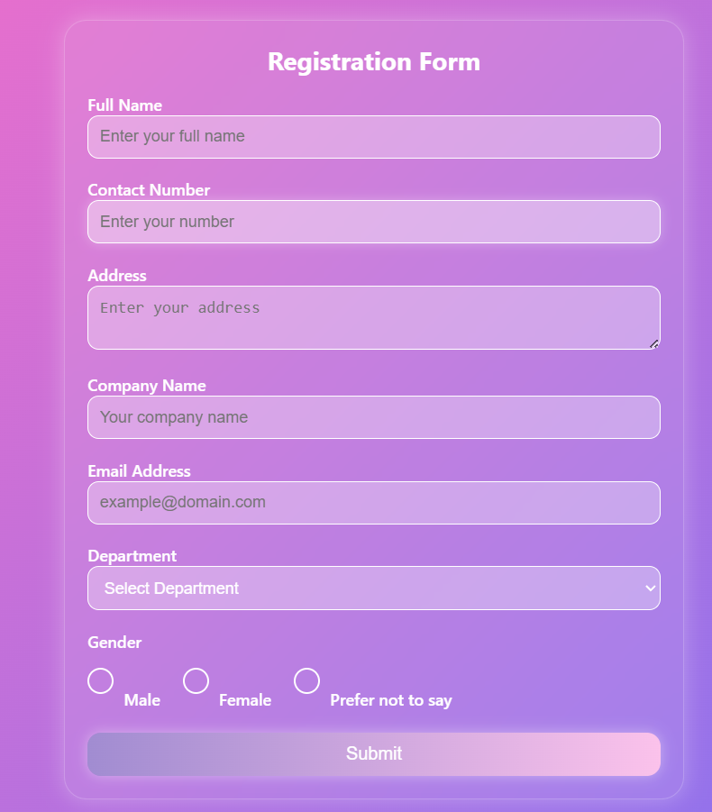

# NeuroNexus Registration Form

{: width="500" height="300"}

A sleek glassmorphic web form built for NeuroNexus Innovations' internship task using pure HTML/CSS.

## ✨ Features
- **Glassmorphism UI**: Frosted glass effect with backdrop blur.
- **Responsive Design**: Works on mobile and desktop.
- **Interactive Elements**: Hover effects, animated gradients.
- **No JavaScript**: Pure HTML/CSS.

## 📂 Files
| File            | Purpose                          |
|-----------------|----------------------------------|
| `index.html`    | Form structure                   |
| `style.css`     | Glassmorphic styling             |
| `forminterface.png` | Screenshot of the form        |

## ✅ Task Requirements Met
- All form fields (Name, Email, Department dropdown, etc.)
- Submit button with hover effect (Bonus)
- Distinct background + box-shadow (Bonus)

